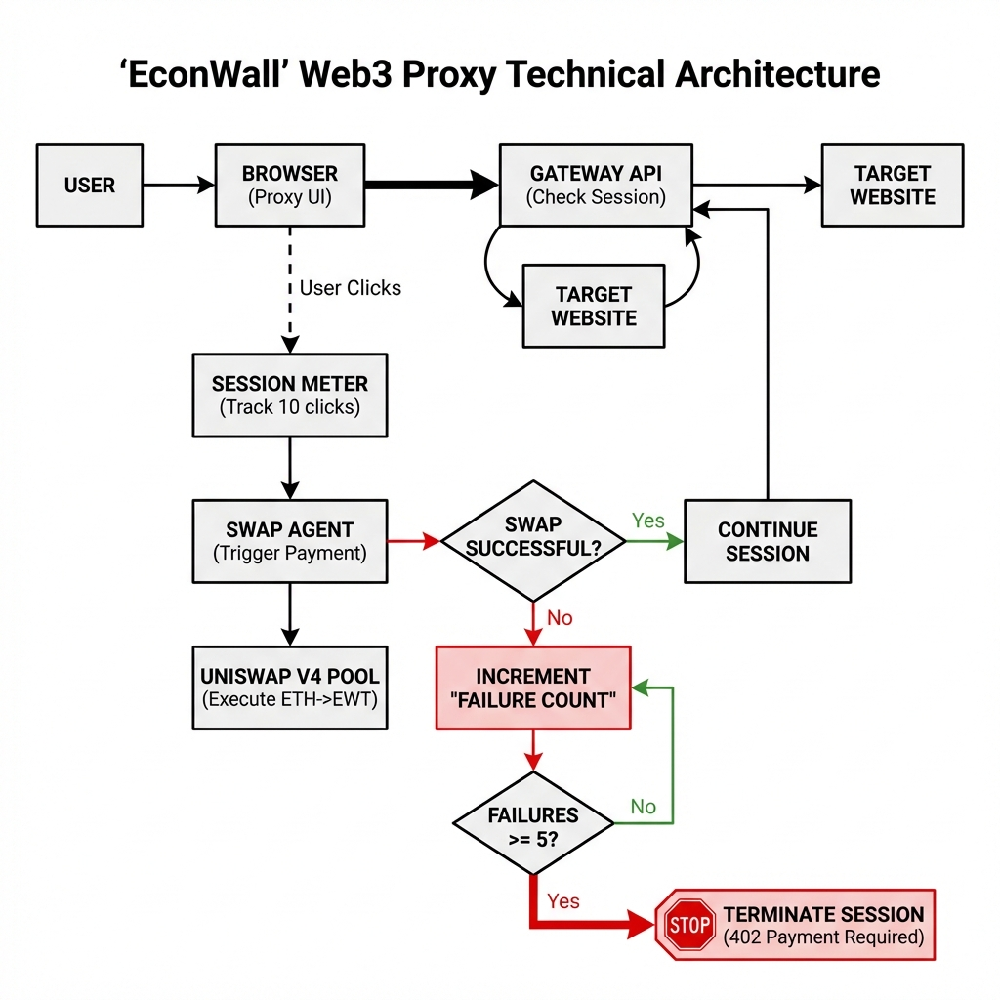
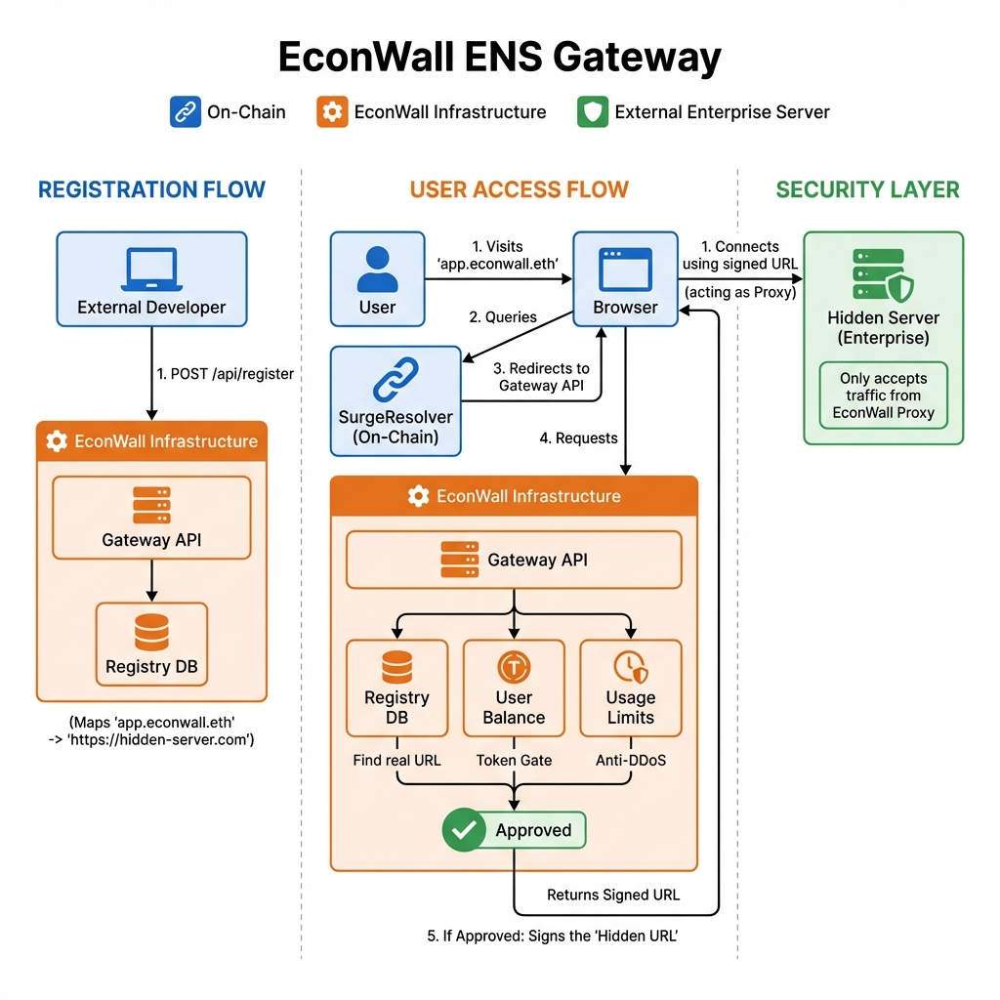

# EconWall

**The Web3-Native Cloudflare.**

### The Problem: Web2 Fragility
Modern web security relies on centralized gatekeepers (Cloudflare, AWS).
*   **Single Point of Failure:** If AWS goes down, half the internet breaks.
*   **Censorship Risk:** Centralized entities can de-platform sites at will.
*   **IP Blocking is Flawed:** Attackers can rotate IPs infinitely. It's a game of Whac-A-Mole.

### The Solution: Economic Friction
**EconWall** replaces fragile IP blocking with an **Economic Firewall**.
Attackers have infinite IPs, but they have **finite money**.

By gating every request behind a micro-payment that ***surges*** during high traffic (via **Uniswap V4 Hooks**), we make DDoS attacks mathematically unaffordable ($1,000+ cost) while legitimate users seamlessly browse for pennies.

*   **Unstoppable Security:** Logic runs entirely on-chain (Unichain).
*   **Privacy Preserved:** No IP tracking. Just cryptographic signatures.
*   **Truly Web3:** Pay-per-request, handled automatically by an embedded Agent Wallet.

---

## System Architecture

EconWall replaces traditional server protections with a blockchain-based economic shield.

### 1. The Core Logic (Failure Flow)
The proxy acts as a middleware. It intercepts requests, verifies the user's "Session Balance" on-chain, and either grants access or demands a micro-payment (swap).

### 2. Surge Pricing Engine (Uniswap V4)
**"The Economic Firewall"**
We utilize a custom Uniswap V4 Hook to implement dynamic fees.
- **Low Traffic:** Base Fee = 0.01%
- **High Traffic (DDoS):** Base Fee = 25.00%
- **Bad Actor:** Personal Multiplier = 10x

**The Result:** A hacker attempting a DDoS attack burns through their funds in seconds ($1,000+ cost), while a normal user browsing for hours pays pennies ($0.06).

#### Dynamic Fee Structure

**A. Global Base Fee (Hourly Activity)**
| Swap Count (Last 1h) | Base Fee | Impact |
| :--- | :--- | :--- |
| **0 - 5** | **0.01%** | Minimal (Standard) |
| **5 - 15** | **0.05%** | Low |
| **15 - 30** | **0.25%** | Moderate |
| **30 - 60** | **1.00%** | High |
| **60 - 100** | **5.00%** | Very High |
| **100 - 150** | **15.00%** | Critical |
| **150+** | **25.00%** | MAX SURGE |

**B. Personal Spam Multiplier (5-Min Window)**
| User Swaps (Last 5m) | Multiplier | Consequence |
| :--- | :--- | :--- |
| **1 - 2** | **1x** | Normal User |
| **3 - 4** | **3x** | Heavy User |
| **5 - 7** | **6x** | Suspicious |
| **8+** | **10x** | FLAG: SPAMMER |

*Final Fee = min(Base Fee × Multiplier, 50%)*

### 3. ENS Gateway & Resolution
**"Decentralized DNS"**
EconWall integrates with ENS (Ethereum Name Service) using **CCIP-Read (EIP-3668)**.
- Users visit `app.econwall.eth`
- The Resolver points them to the EconWall Gateway
- The Gateway verifies the user and signs the *real* hidden server URL
- The browser accesses the content via the secure Proxy.

## Uniswap Contracts (Unichain Sepolia)

| Contract | Address |
| :--- | :--- |
| **Pool Manager** | [0x00b0...62ac](https://unichain-sepolia.blockscout.com/address/0x00b036b58a818b1bc34d502d3fe730db729e62ac) |
| **Universal Router** | [0xf705...be5d](https://unichain-sepolia.blockscout.com/address/0xf70536b3bcc1bd1a972dc186a2cf84cc6da6be5d) |
| **Surge Hook** | [0xbB96...40c0](https://unichain-sepolia.blockscout.com/address/0xbB9620C96A409d321552Cff9F8c1397b879440c0) |
| **Custom Token (EWT)** | [0x312C...B043](https://unichain-sepolia.blockscout.com/address/0x312CF8c8F041df4444A19e0525452aE362F3B043) |
| **Position Manager** | [0xf969...d664](https://unichain-sepolia.blockscout.com/address/0xf969aee60879c54baaed9f3ed26147db216fd664) |
| **Quoter** | [0x56dc...4472](https://unichain-sepolia.blockscout.com/address/0x56dcd40a3f2d466f48e7f48bdbe5cc9b92ae4472) |

---

## Key Features

- **Token-Gated Browser:** An embedded secure browser that handles session signing and decryption.
- **Agentic Wallet:** Automatically handles micro-swaps in the background to keep the session alive.
- **Encrypted Routing:** Real server URLs are AES-256 encrypted and never exposed to the client until authorized.
- **Unichain Sepolia:** Deployed on Unichain for low-latency, high-throughput execution.

---

